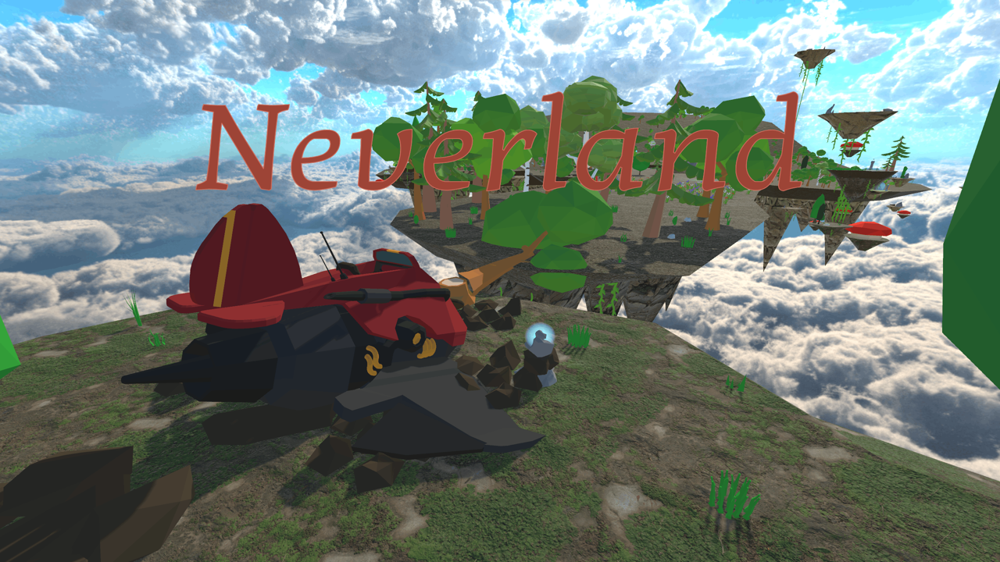
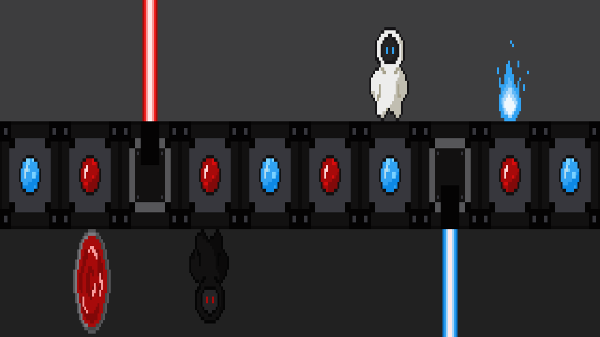
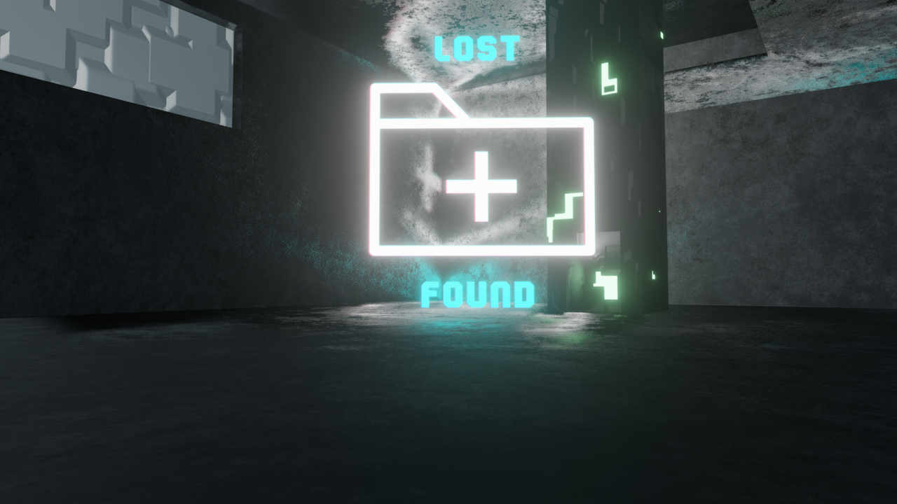

{}
N'hésitez pas à cliquer sur mes divers projets pour en savoir plus.
{.mt-5}
{}



  
  

    <h2><a href="/mes-projets-de-jeux/neverland">Neverland</a></h2>
    <h3>Neverland est un jeu de plateforme et d'exploration dans un monde aérien, produit dans le cadre d'un cours de conception et développement de jeux, en équipe de 5 personnes sur Unity.</h3>
  





  
  

    <h2><a href="/mes-projets-de-jeux/galaxy-potatoes">Galaxy Potatoes</a></h2>
    <h3>Galaxy Potatoes est un petit jeu en 3 dimensions, dans un univers spatial créé sur Unity lors de la WonderJam Automne 2023.</h3>
  





  
  

    <h2><a href="/mes-projets-de-jeux/liveandevil">Live & Evil</a></h2>
    <h3>Un jeu de puzzle créé sur Unity à l'occasion de la game jam CodinBlocks 2022.</h3>
  





  
  

    <h2><a href="/mes-projets-de-jeux/nyasteroid">Nyasteroid</a></h2>
    <h3>Un jeu d'arcade spatial développé sur Godot lors de la MiniJam 84: Bubbles.</h3>
  





  
  

    <h2><a href="/mes-projets-de-jeux/lostpfound">Lost+Found</a></h2>
    <h3>Un jeu d'ambiance 3D, produit sur Unity lors de la game jam EMMI 2021 supervisée par des membres d'Asobo Studios et Ubisoft Bordeaux. </h3>
  

{}



  
  

    <h2>[TBA] G.O.O.H.</h2>
    <h3>Jeu d'horreur dans l'espace, actuellement en développement sur Unreal Engine dans le cadre du cours d'Atelier Pratique en Jeux Vidéos I.</h3>
  

{}

