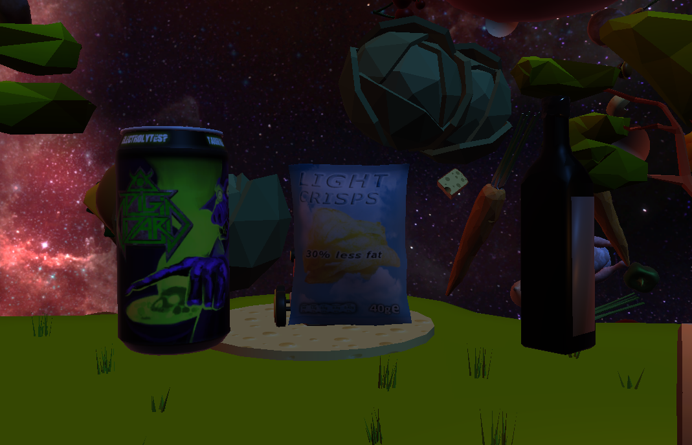

{}

{}

{}

    <i class="fab fa-unity fa-3x" style="margin-right: 2rem;"></i>
    <i class="fa-solid fa-user-group fa-2x"> : 4</i>

Galaxy Potatoes est un petit jeux dans lequel vous devrez place des objets qui dévieront une patate de sa trajectoire afin qu'elle atteingne son objectif.  

Vous pouvez retrouver le projet sur la page [Itch](https://thalia33.itch.io/galaxy-potatoes).

{}

{}

<h1>Présentation globale et contraintes :</h1>

Galaxy Potatoes est un jeu créé lors de la WonderJam Hiver 2023 à l'UQAC où l'utilisateur·ice est plongé·e dans un univers spatial où iel devra résoudre des objectifs donnés par le maître du jeu, modélisé sous forme d'un maïs humanoïde. Le thème de cette game jam était Hot Potato et nous avions les contraintes suivantes : Liberté, Système de quête et Univers dans l'espace. Ces trois thèmes ont été respectés en laissant l'utilisateur·ice la liberté de se déplacer dans le monde, dans un univers spatial tout en gardant un petit système de quêtes sous forme d'objectifs donnés par le maître du jeu. Il est important de noter que le jeu possède encore de nombreux bugs et n'est pas forcément jouable comme souhaité à 100%.

    

        

            <!-- Assurez-vous que l'URL de l'image est correcte -->
            
        

        

            <h2>Objectifs et phases de jeux :</h2>
            
Comme cité précédemment, le jeu se passe en deux phases principales. La première démarre lorsque le maître du jeu nous donne notre première quête (débloquable lorsque l'on s'approche de lui), sous forme d'objectif que doit atteindre une patate (un lieu précis, une certaine vitesse et/ou en un certain temps). Une fois ces objectifs pris en compte, nous avons accès à trois types d'objets différents que l'on peut placer où on veut et qui vont avoir des comportements différents au contact de la patate. Une fois les objets placés, la deuxième phase commence : on entre dans le canon, on vise et on tire une patate. Cette patate va rencontrer divers obstacles tels que l'environnement ou les objets placés préalablement afin d'atteindre l'objectif en cours. Si la·e joueur·euse parvient à atteindre son but, iel peut passer au suivant, sinon iel doit recommencer les deux phases. 

        

        

            <h2>Objets :</h2>
            
Comme cité précédemment, les objets sont centraux dans la réussite des objectifs. Je me suis donc occupée de gérer le comportement des objets.

            <ul>
                <li>La canette : augmente la vitesse de la patate au contact</li>
                <li>Le paquet de chips : fait rebondir la canette</li>
                <li>La bouteille : augmente la vitesse de la patate et change sa direction (direction donnée par l'orientation du bouchon)</li>
            </ul>
        

        

            <!-- Assurez-vous que l'URL de l'image est correcte -->
            
        

    

    

        

            <iframe width="100%" height="300" scrolling="no" frameborder="no" allow="autoplay" src="https://w.soundcloud.com/player/?url=https%3A//api.soundcloud.com/tracks/1637063007&color=%23ff5500&auto_play=false&hide_related=false&show_comments=true&show_user=true&show_reposts=false&show_teaser=true&visual=true"></iframe>
<a href="https://soundcloud.com/user-794926574" title="Thalia Meignan" target="_blank" style="color: #cccccc; text-decoration: none;">Thalia Meignan</a> · <a href="https://soundcloud.com/user-794926574/quests-in-space" title="Quests In Space" target="_blank" style="color: #cccccc; text-decoration: none;">Quests In Space</a>

        

        

            <h2>Musique :</h2>
            
Durant la game jam, je me suis aussi occupée de composer la musique du jeu. J'ai donc composé le morceau que vous pouvez écouter ci contre, en utilisant FL Studio, et des vst/plugins tels que Sytrus, Vital ou encore Flex. 

        

    

{}
