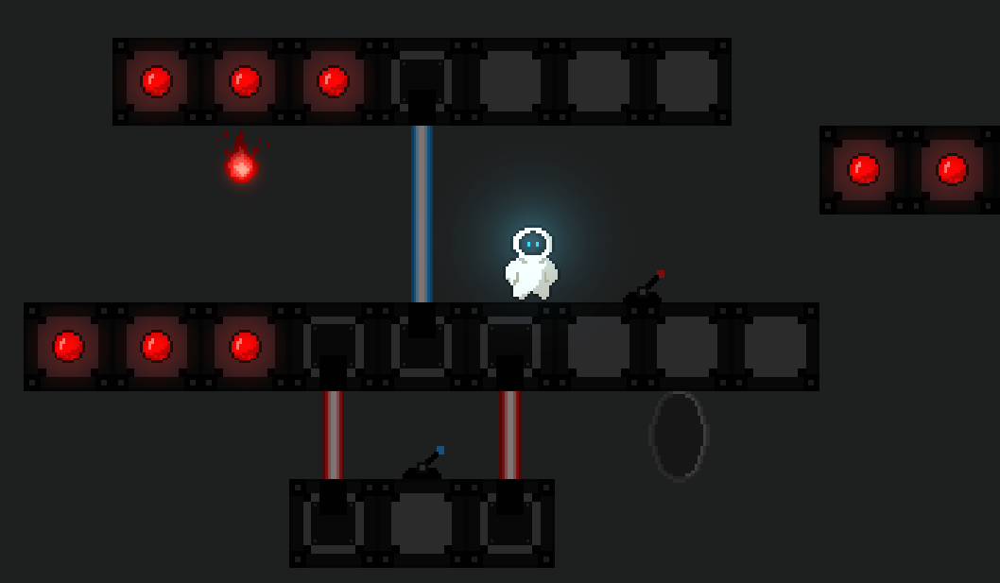

{}

{}

{}

    <i class="fab fa-unity fa-3x" style="margin-right: 2rem;"></i>
    <i class="fa-solid fa-user-group fa-2x"> : 3</i>

Live&Evil est un jeu de puzzle avec divers mécaniques de déplacements et de résolution.

Vous pouvez retrouver le projet sur la page [Itch](https://zaksley.itch.io/live-and-evil).

{}

{}

<iframe frameborder="0" src="https://itch.io/embed-upload/5131403?color=2f2f2f" allowfullscreen="" width="1280" height="720"><a href="https://zaksley.itch.io/live-and-evil">Play Live &amp; Evil on itch.io</a></iframe>

    

        

            <h2>Présentation globale et thèmes: </h1>
            
Nous avons créé Live&Evil dans le cadre de la game jam CodinBlocks de 2022, dont le thème était "It's following me". Dans ce jeu, la·e joueur·euse doit arriver d'un bout à l'autre de chaque tableau sans tomber ni mourir. Pour cela, le personnage possède deux états : l'état de base et l'état maléfique. Ce deuxième état change le monde, on se retrouve à l'envers avec la gravité inversée, ce qui permet de ramasser des objets, activer des leviers, voir des plateformes invisibles ou plus simplement traverser des obstacles. 

        

        

            
        

        

            <iframe width="100%" height="300" scrolling="no" frameborder="no" allow="autoplay" src="https://w.soundcloud.com/player/?url=https%3A//api.soundcloud.com/playlists/1384755244&color=%23ff5500&auto_play=false&hide_related=false&show_comments=true&show_user=true&show_reposts=false&show_teaser=true&visual=true"></iframe>
<a href="https://soundcloud.com/user-794926574" title="Thalia Meignan" target="_blank" style="color: #cccccc; text-decoration: none;">Thalia Meignan</a> · <a href="https://soundcloud.com/user-794926574/sets/live-evil-soundtrack" title="Live &amp; Evil (soundtrack)" target="_blank" style="color: #cccccc; text-decoration: none;">Live &amp; Evil (soundtrack)</a>

        

        

            <h2>Musiques :</h2>
            
Cette game jam fut un exercice très intéressant d'un point de vue musique. En effet, étant donné que l'on peut passer d'un état à un autre j'ai fait deux musiques différentes : une assez joyeuse et entrainante et l'autre plus sombre. Pour avoir une bonne cohérence j'ai d'abord composé une permière musique pour ensuite reprendre la même structure, la même durée et quelques instruments similaires (pour la batterie et le piano notamment). Au niveau de l'intégration, j'ai fait en sorte de jouer les deux musiques en même temps, et de faire un crossfade de volume lors du changement d'état afin que les deux musiques soient bien synchronisées et que les transitions soient les plus harmonieux possibles.

        

    

{}