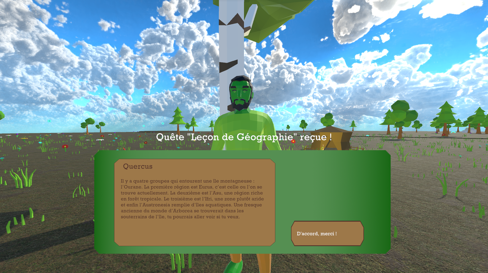

{}

{}

{}

    <i class="fab fa-unity fa-3x" style="margin-right: 2rem;"></i>
    <i class="fa-solid fa-user-group fa-2x"> : 5</i>

Neverland est un jeu d'exploration et de quêtes dans lequel on incarne Camille, qui après un crash rencontre un peuple qui ne lui font pas confiance...

Vous pouvez retrouver le projet et y jouer sur la page [Itch](https://nekkiji.itch.io/neverland).

{}

{}

    

        <!-- Remplacez 'ID_DE_LA_VIDÉO' par l'ID réel de votre vidéo YouTube -->
        <iframe width="560" height="315" src="https://www.youtube.com/embed/laGFM_O1N3U" frameborder="0" allow="accelerometer; autoplay; encrypted-media; gyroscope; picture-in-picture" allowfullscreen></iframe>
    

    

        <h1>Présentation globale :</h1>
        
Nous avons créé Neverland dans le cadre du cours 8INF960 Principes de conception et de développement de jeux vidéo. En équipe, nous avons suivi différentes étapes de conception : document de concept, document de game design, développement par méthode agile, présentation et post-mortem.

        
Neverland est un jeu de plateforme et d'exploration en 3D dans lequel on joue Camille, venant d'une civilation avancée qui, après un crash, doit apprendre à vivre avec un peuple méfiant : les Sylves. Le but de ce jeu est d'explorer le monde, aider les Sylves ainsi que résoudre des énigmes et ce sous forme de quêtes. 

        
Durant tout ce projet j'ai pu réaliser de nombreuses tâches :

    

    

        

            <!-- Assurez-vous que l'URL de l'image est correcte -->
            
        

        

            <h2>Dialogues :</h2>
            
Les dialogues dans neverland sont très importants car ils permettent de comprendre le jeu, l'histoire, de débloquer des quêtes ainsi que les résoudres. Afin de permettre une plus grande flexibilité, j'ai utilisé des fichiers XML dans lesquels stocker les dialogues. Le fait d'utiliser les XML permet donc d'avoir un seul script pour tous les personnages, la seule chose à changer sera donc les XML en entrée ce qui rend le tout beaucoup plus modulable. Il est donc possible grâce à ce système d'avoir des dialogues dynamiques, avec divers embranchements, pouvant aussi servir à débloquer des quêtes une fois un dialogue spécifique fini. 

        

        

            <h2>Musiques et sons :</h2>
            
La musique et les sons sont très importants dans un jeu tel que celui-ci. En effet, afin d'avoir une meilleure immersion, l'objectif était de remplir au maximum l'espace sonore : bruits de pas, bruits environnants (oiseaux, air, rivière) tout en ne surchargeant pas non plus la·e joueur·euse. Concernant la musique, il y en a 3 principales, jouées à des intervalles aléatoires, permettant à la fois d'avoir un fond sonore intéressant mais encore une fois pas omniprésent. Tout à été composé sur FL Studio, en utilisant principalement des vst tels que Vital ou encore les librairies de spitfire audio.

        

        

            <!-- Assurez-vous que l'URL de l'image est correcte -->
            <iframe width="100%" height="300" scrolling="no" frameborder="no" allow="autoplay" src="https://w.soundcloud.com/player/?url=https%3A//api.soundcloud.com/playlists/1757242392&color=%23ff5500&auto_play=false&hide_related=false&show_comments=true&show_user=true&show_reposts=false&show_teaser=true&visual=true"></iframe>
<a href="https://soundcloud.com/user-794926574" title="Thalia Meignan" target="_blank" style="color: #cccccc; text-decoration: none;">Thalia Meignan</a> · <a href="https://soundcloud.com/user-794926574/sets/neverland-soundtrack" title="Neverland Soundtrack" target="_blank" style="color: #cccccc; text-decoration: none;">Neverland Soundtrack</a>

        

        

            <h2>Intégration et divers : </h2>
            
Bien que les dialogues et la musiques / sound design aient été mes priorités, j'ai pu aussi m'occuper de fonctionnalités mineures (ou non implémentées)ainsi qu'une bonne partie de l'intégration finale. Parmis les fonctionnalités mineures, nous avons par exemple le système d'intéractions avec les objets et personnages non joueurs, mais aussi un cycle jour / nuit (qui n'a malheureusement pas pu être implémenté au final).

            
Au niveau de l'intégration finale, je me suis principalement occupée de tout ce qui était relatif aux sons mais aussi au niveau des PNJs (placements, déroulement des quêtes, téléportations aux bons endroits lorsque nécessaires...). 

        

    

{}
