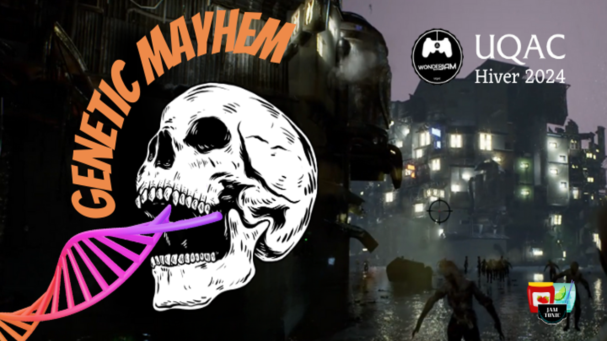
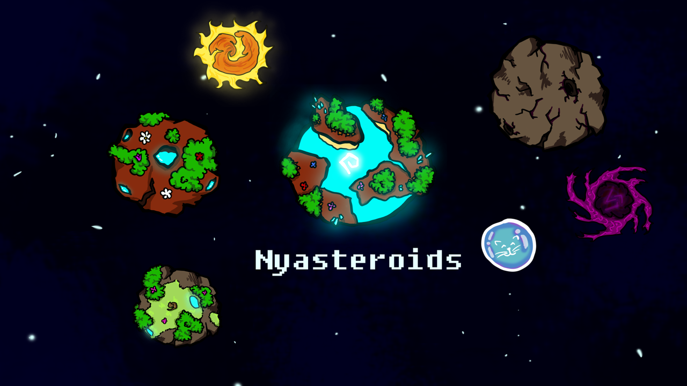
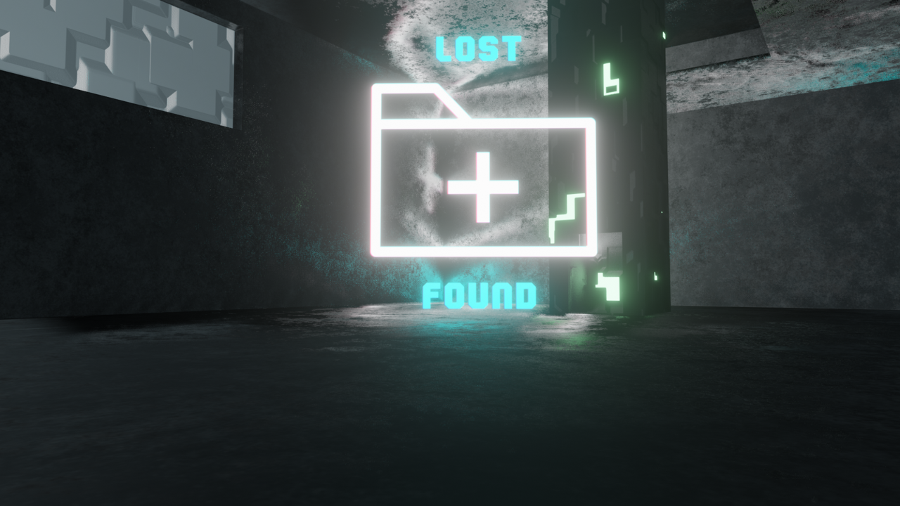
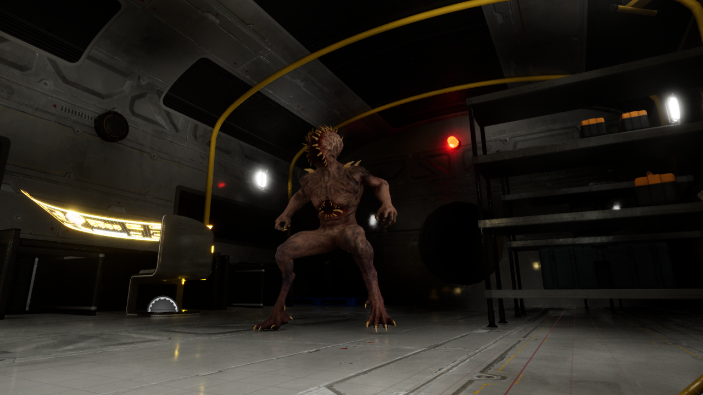
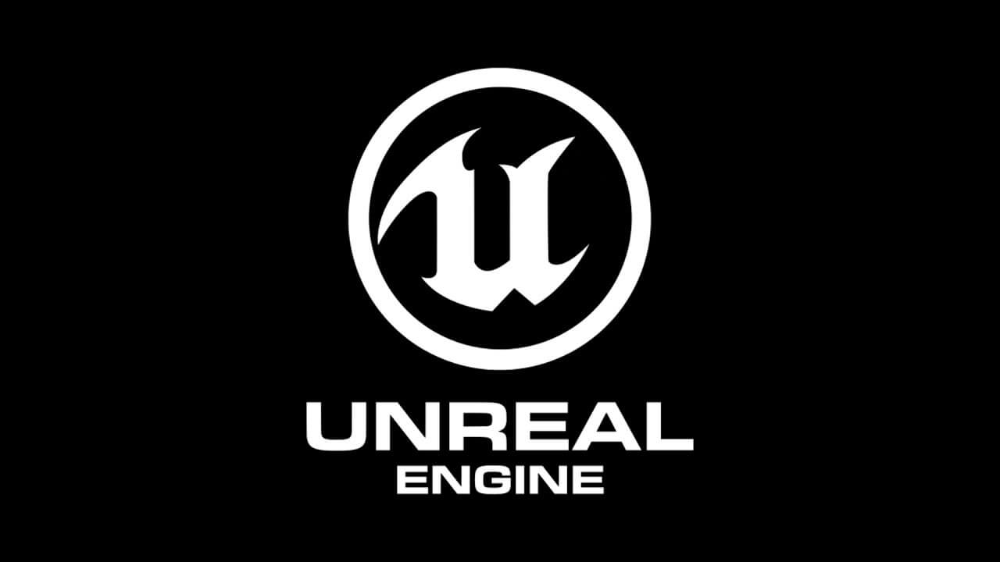

{}
N'hésitez pas à cliquer sur mes divers projets pour en savoir plus.
{.mt-5}
{}



  
  

    <h2><a href="/thalia-portfolio/mes-projets-de-jeux/geneticmayhem">Genetic Mayhem</a></h2>
    <h3>Genetic Mayhem est un FPS survival horror dans lequel vous aurez à survivre contre des hordes de zombie, créé à l'occasion de la WonderJam Hiver 2024.</h3>
  





  
  

    <h2><a href="/thalia-portfolio/mes-projets-de-jeux/neverland">Neverland</a></h2>
    <h3>Neverland est un jeu de plateforme et d'exploration dans un monde aérien, produit dans le cadre d'un cours de conception et développement de jeux, en équipe de 5 personnes sur Unity.</h3>
  





  
  

    <h2><a href="/thalia-portfolio/mes-projets-de-jeux/galaxy-potatoes">Galaxy Potatoes</a></h2>
    <h3>Galaxy Potatoes est un petit jeu en 3 dimensions, dans un univers spatial créé sur Unity lors de la WonderJam Automne 2023.</h3>
  





  
  

    <h2><a href="/thalia-portfolio/mes-projets-de-jeux/liveandevil">Live & Evil</a></h2>
    <h3>Un jeu de puzzle créé sur Unity à l'occasion de la game jam CodinBlocks 2022.</h3>
  





  
  

    <h2><a href="/thalia-portfolio/mes-projets-de-jeux/nyasteroid">Nyasteroid</a></h2>
    <h3>Un jeu d'arcade spatial développé sur Godot lors de la MiniJam 84: Bubbles.</h3>
  





  
  

    <h2><a href="/thalia-portfolio/mes-projets-de-jeux/lostpfound">Lost+Found</a></h2>
    <h3>Un jeu d'ambiance 3D, produit sur Unity lors de la game jam EMMI 2021 supervisée par des membres d'Asobo Studios et Ubisoft Bordeaux. </h3>
  

{}



    
  

    <h2>[En cours] G.O.O.H.</h2>
    <h3>Jeu d'horreur dans l'espace, actuellement en développement sur Unreal Engine dans le cadre du cours d'Atelier Pratique en Jeux Vidéos I.</h3>
  

{}



  
  

    <h2>[En cours] Dragon's Forge : The Fitness Crusade</h2>
    <h3>Jeux de fitness / rééducation physique en réalité virtuelle dans un univers médiéval. Jeu en cours de création dans le cadre des cours de jeu sérieux et de réalité virtuelle.</h3>
  

{}



  
  

    <h2>[En cours] ShootingGame</h2>
    <h3>FPS multijoueur en réseau créé sur Unreal dans le cadre du cours de programmation réseau dans les jeux vidéo</h3>
  

{}

