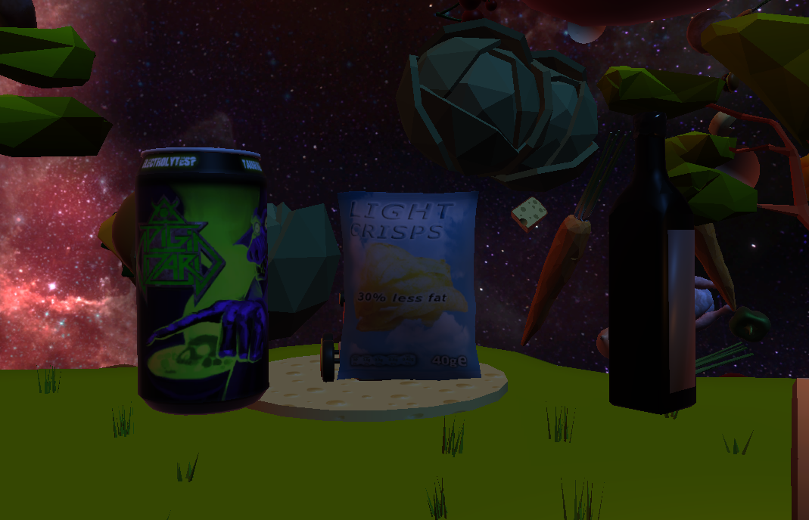

{}

{}

{}

    <i class="fab fa-unity fa-3x" style="margin-right: 2rem;"></i>
    <i class="fa-solid fa-user-group fa-2x"> : 4</i>

Galaxy Potatoes est un jeu 3D où vous devez placer des objets pour dévier une patate de sa trajectoire afin qu'elle atteigne son objectif.

[Retrouvez le projet sur la page Itch](https://thalia33.itch.io/galaxy-potatoes).

{}

{}

<h1>Présentation globale et contraintes :</h1>

Galaxy Potatoes est un jeu conçu lors de la WonderJam Hiver 2023 à l'UQAC. Le joueur est immergé dans un univers spatial et doit résoudre des objectifs donnés par un maïs humanoïde, maître du jeu. Le thème de la game jam était "Hot Potato", avec des contraintes telles que liberté, système de quêtes et univers spatial. Nous avons intégré ces éléments en permettant au joueur de se déplacer librement dans l'espace avec un système de quêtes. Il est important de noter que le jeu présente encore de nombreux bugs et n'est pas totalement jouable comme prévu.

    

        

            <!-- Assurez-vous que l'URL de l'image est correcte -->
            
        

        

            <h2>Objectifs et phases de jeu :</h2>
            
Le jeu se déroule en deux phases principales. Tout commence lorsque le maître du jeu nous donne notre première quête, accessible en s'approchant de lui. Cette quête consiste en un objectif que doit atteindre une patate (atteindre un lieu précis, une certaine vitesse, ou dans un temps imparti). Après avoir pris en compte ces objectifs, nous pouvons placer trois types d'objets aux comportements variés. Une fois les objets en place, la seconde phase commence : on lance une patate depuis un canon, et elle doit franchir divers obstacles, y compris les objets placés, pour atteindre l'objectif. Si le joueur réussit, il passe au prochain objectif, sinon il doit recommencer.

        

        

            <h2>Objets :</h2>
            
Les objets sont des éléments centraux dans la réussite des objectifs. Voici les fonctions de chacuns d'entre eux :

            <ul>
                <li>La canette : accélère la patate au contact.</li>
                <li>Le paquet de chips : fait rebondir la patate.</li>
                <li>La bouteille : accélère et change la direction de la patate (selon l'orientation du bouchon).</li>
            </ul>
        

        

            <!-- Assurez-vous que l'URL de l'image est correcte -->
            
        

    

    

        

            <iframe width="100%" height="300" scrolling="no" frameborder="no" allow="autoplay" src="https://w.soundcloud.com/player/?url=https%3A//api.soundcloud.com/tracks/1637063007&color=%23ff5500&auto_play=false&hide_related=false&show_comments=true&show_user=true&show_reposts=false&show_teaser=true&visual=true"></iframe>
<a href="https://soundcloud.com/user-794926574" title="Thalia Meignan" target="_blank" style="color: #cccccc; text-decoration: none;">Thalia Meignan</a> · <a href="https://soundcloud.com/user-794926574/quests-in-space" title="Quests In Space" target="_blank" style="color: #cccccc; text-decoration: none;">Quests In Space</a>

        

        

            <h2>Musique :</h2>
            
Je me suis également chargée de la composition musicale du jeu pendant la game jam. Le morceau que vous pouvez écouter ici a été composé avec FL Studio, en utilisant des VST/plugins comme Sytrus, Vital ou Flex.

        

    

{}