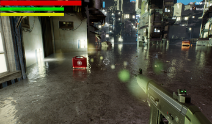
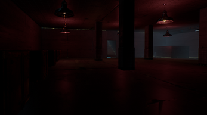

{}

{}

<link rel="stylesheet" type='text/css' href="https://cdn.jsdelivr.net/gh/devicons/devicon@latest/devicon.min.css" />
          
{}

    <i class="devicon-unrealengine-original" style="font-size: 5rem; margin-right: 2rem;"></i>
    

        <i class="fas fa-user-group" style="font-size: 3rem; margin-right: 0.5rem;"> : 5</i> 
    

Genetic Mayhem est un shooter survival-horror dans un univers post apocalyptique, dans lequel vous devrez survivre le plus de jours possibles, sans se faire tuer ou pire, dévorer par les nombreux zombies peuplant Soul City...

[Retrouvez le projet sur la page Itch](https://thalmug.itch.io/genetic-mayhem).
{}

{}

    

        

            
        

        

            <h1>Présentation globale et thèmes: </h1>
            
Ce jeu à été créé lors de la WonderJam Hiver 2024, ayant pour thème "Genetics". Le but du jeu est de survivre le plus longtemps et de récolter le plus de points d'ADN possible afin de pouvoir améliorer vos capacités. Les trois contraintes principales étaient : Jeu avec une mécanique d'horreur, liberté de mouvement et éléments de survie.

        

    

    

        

            <h2>Mécaniques principales et level design :</h2>
            
Lors de cette game jam je me suis occupée dans un premier temps d'implémenter les bases du joueur : déplacements, shooting et animations relatives à l'arme. Une fois ceci fait, j'ai pris du temps pour intégrer diverses mécaniques mineures mais aussi pour créer une partie du niveau final.

        

        

            
        

        

            <iframe width="100%" height="300" scrolling="no" frameborder="no" allow="autoplay" src="https://w.soundcloud.com/player/?url=https%3A//api.soundcloud.com/playlists/1786359261&color=%23ff5500&auto_play=false&hide_related=false&show_comments=true&show_user=true&show_reposts=false&show_teaser=true"></iframe>
<a href="https://soundcloud.com/user-794926574" title="Thalia Meignan" target="_blank" style="color: #cccccc; text-decoration: none;">Thalia Meignan</a> · <a href="https://soundcloud.com/user-794926574/sets/genetic-mayhem-soundtrack" title="Genetic Mayhem (Soundtrack)" target="_blank" style="color: #cccccc; text-decoration: none;">Genetic Mayhem (Soundtrack)</a>

        

        

            <h2>Musiques, sons et intégration :</h2>
            
Durant cette game jam, je me suis aussi occupée de toute la partie de conception sonore et de la composition de 3 musiques. Le but était d'abord de créer une musique d'ambiance pour les phases calmes du gameplay, puis une autre plus impactante dans les phases de combat plus soutenues. 

        

    

{}