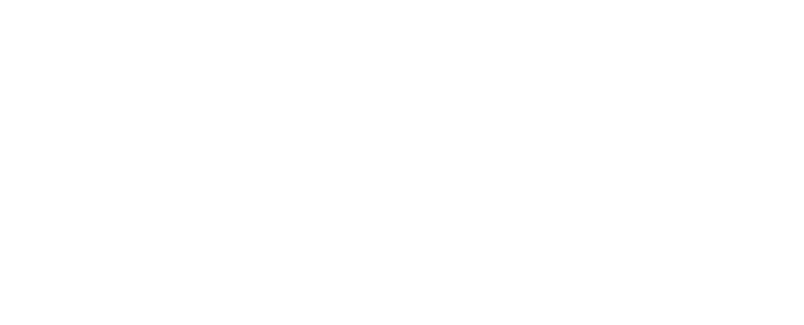

{}

{}

{}

    
    <i class="fa-solid fa-user-group fa-2x"> : 4</i>

Nyasteroid est un jeu d'arcade captivant où vous devez sauver des planètes tout en combattant l'environnement qui cherche à les détruire.

[Découvrez le projet sur la page Itch](https://metamaus.itch.io/nyasteroid).

{}

{}

<iframe frameborder="0" src="https://itch.io/embed-upload/4150122?color=000000" allowfullscreen="" width="1280" height="720"><a href="https://metamaus.itch.io/nyasteroid">Jouez à Nyasteroid sur itch.io</a></iframe>

    

        <h1>Présentation globale et thèmes: </h1>
        
Nyastéroid a été créé par notre équipe de 4 lors de la Minijam 84, sur le thème "Bubbles". Le jeu consiste à récolter un maximum de points en 3 minutes, tout en évitant de perdre sa vie. Nous avons intégré le thème "bubbles" et la contrainte "tu es ta propre munition" avec deux types de ressources : des bulles de vie, rechargeables sur la planète centrale, et des morceaux de roche, servant à la fois de points de vie et de munitions.

    

    

        

            <h2>Éléments et objectif du jeu : </h2>
            
Le jeu comprend des entités positives et négatives. Les entités positives incluent une planète centrale indestructible, qui recharge les bulles de vie, et des petites planètes à sauver en utilisant les bulles de vie (clic droit), ce qui augmente le score. Les entités négatives incluent les supernovas, les trous noirs (attirant le joueur), et les soleils, qui lancent des comètes pouvant endommager le joueur et les planètes. Les comètes sont détruisibles en utilisant les ressources en roche.

        

        

            
        

        

            <!-- Assurez-vous que l'URL de l'image est correcte -->
            <iframe width="100%" height="300" scrolling="no" frameborder="no" allow="autoplay" src="https://w.soundcloud.com/player/?url=https%3A//api.soundcloud.com/playlists/1289323441&color=%23ff5500&auto_play=false&hide_related=false&show_comments=true&show_user=true&show_reposts=false&show_teaser=true&visual=true"></iframe>
<a href="https://soundcloud.com/user-794926574" title="Thalia Meignan" target="_blank" style="color: #cccccc; text-decoration: none;">Thalia Meignan</a> · <a href="https://soundcloud.com/user-794926574/sets/nyasteroid-soundtrack" title="Bande sonore de Nyasteroid" target="_blank" style="color: #cccccc; text-decoration: none;">Nyasteroid (Soundtrack)</a>

        

        

            <h2>Musiques, sons et intégration :</h2>
            
Ma contribution principale lors de cette jam a été la composition de la musique et du design sonore. J'ai utilisé FL Studio, Vital, Flex et d'autres plugins pour créer une musique percutante avec des nappes sonores "aériennes". J'ai aussi créé les sons pour les interactions du jeu, comme le gain et la perte de vie des planètes.

        

    

{}